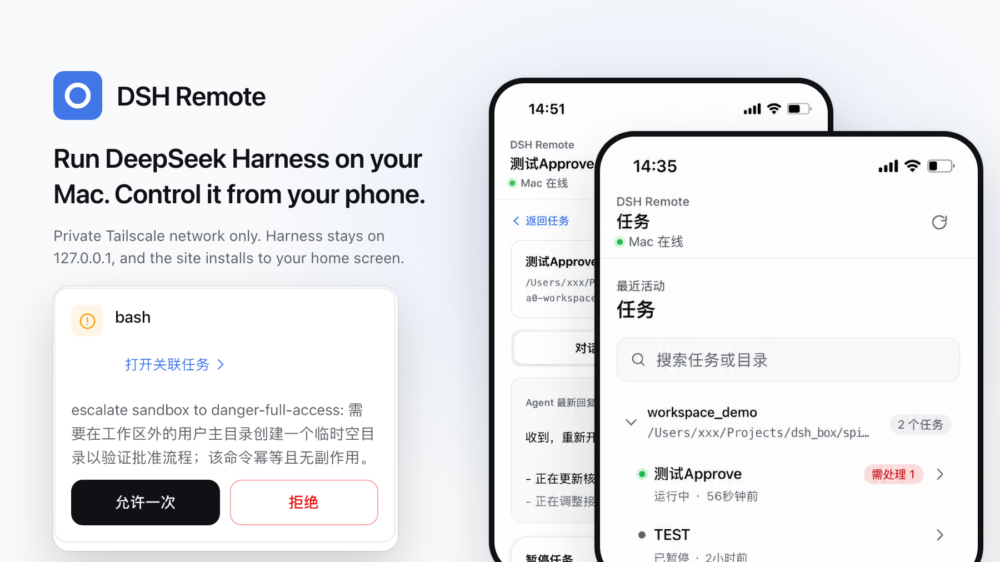

# DSH Remote

[](https://github.com/Zouu-X/dsh_remote/actions/workflows/ci.yml)
[](LICENSE)

**Run DeepSeek Harness on your Mac. Control it from your phone.**

DSH Remote gives [DeepSeek Harness](https://github.com/deepseek-ai/deepseek-harness) a focused, mobile-first workspace over your private Tailscale network. Start tasks away from your desk, follow the Agent live, handle approvals, and read the result without exposing Harness to the public internet.

[中文说明](README.md)

<!-- README_MEDIA_SLOT:HERO -->

<p align="center">
  
</p>
<p align="center"><sub>The mobile UI ships in Simplified Chinese.</sub></p>

## What you can do

- Start a task in any workspace already configured on your Mac.
- Choose the Agent preset, model, and reasoning effort before you begin.
- Follow Agent messages and task status live from a phone-friendly conversation.
- Queue the next instruction or steer a running session from the task composer.
- Answer Agent questions and allow or reject one-time permission requests.
- Search and resume existing tasks from a phone-friendly workspace view.
- Install the site on your home screen as a PWA with automatic reconnect handling.

## Install

You need:

- a Mac with a configured DeepSeek Harness credential;
- Tailscale on the Mac and phone, signed in to the same tailnet;
- MagicDNS enabled for that tailnet.

### 1. Run the guided setup

```bash
git clone https://github.com/Zouu-X/dsh_remote.git dsh-remote
cd dsh-remote
./macos/launch-agent/setup.sh
```

The setup checks the Mac environment, installs project dependencies, builds the mobile app, installs the user LaunchAgent, configures Tailscale Serve, and prints the phone URL. If Node.js or Tailscale is missing and Homebrew is available, it offers the standard installation path.

### 2. Start DeepSeek Harness

The setup prints the exact command for your Mac. It looks like:

```bash
npx @deepseek-ai/dsh web --trusted-host <your-mac>.<your-tailnet>.ts.net
```

Keep Harness running. DSH Remote follows it automatically and becomes available whenever Harness is listening on `127.0.0.1:3080`.

### 3. Open it on your phone

Open the URL printed by setup:

```text
https://<your-mac>.<your-tailnet>.ts.net
```

Add it to the home screen for an app-like launch experience.

## A phone workflow that stays out of the way

1. Open **New task** and select a workspace.
2. Pick the work mode and, when needed, the model and reasoning effort.
3. Send the task and watch the Agent work in real time.
4. Handle questions and one-time approvals from **Approvals**.
5. Return to the task conversation to read the Agent's result or send a follow-up.
6. Continue the same task later from **Tasks**.

<!-- README_MEDIA_SLOT:WORKFLOW_DEMO -->

## Private by design

DSH Remote keeps the sensitive part of the stack on your Mac:

- DeepSeek Harness listens only on `127.0.0.1:3080`.
- The Remote Host listens only on `127.0.0.1:3090`.
- Tailscale Serve provides the private HTTPS entrypoint; Tailscale Funnel is never used.
- The Remote Host resolves the real Tailscale peer from the trusted loopback proxy connection instead of trusting browser-supplied identity headers.
- Only the remote task methods listed below are available. Credentials, settings, local file pickers, and preset authoring remain local-only.
- The DeepSeek API credential stays in Harness' own credential file and is never read by DSH Remote.
- The Remote Host device private key is stored in macOS Keychain.

DSH Remote is designed for a personal Mac and a private, single-user tailnet. You can restrict access to specific phone devices with the included allowlist manager.

## Restrict access to your phone

By default, devices already authenticated to your tailnet can reach the Remote Host. To allow only selected devices:

```bash
# Find the phone's Tailscale node ID.
tailscale status

# Add the phone to the allowlist.
macos/launch-agent/devices.sh add <tailscale-device-id>

# Inspect the active allowlist.
macos/launch-agent/devices.sh list
```

Changes take effect immediately after the LaunchAgent restarts. Removing the final allowed device is refused so an edit cannot silently widen access. To intentionally return to tailnet-wide access, run:

```bash
macos/launch-agent/devices.sh allow-all
```

## Everyday operation

The installed user LaunchAgent starts at login and waits for Harness. When Harness starts, DSH Remote comes online; when Harness stops, the Remote Host follows it down. With the default `auto` wake policy, macOS stays awake only while a Harness session is running.

Useful commands:

```bash
# Confirm both local services.
lsof -nP -iTCP:3080 -sTCP:LISTEN
lsof -nP -iTCP:3090 -sTCP:LISTEN

# Check the local Remote Host.
curl http://127.0.0.1:3090/api/health

# Inspect Tailscale Serve.
tailscale serve status

# Follow logs.
tail -f ~/.dsh-remote/logs/remote-host.err.log
```

To uninstall the LaunchAgents:

```bash
macos/launch-agent/uninstall.sh
```

## Manual setup

Use this path when you want to control each step yourself.

### Build

```bash
corepack pnpm install
corepack pnpm -r build
```

### Resolve the MagicDNS hostname

```bash
DSH_TS_HOST=$(tailscale status --json | python3 -c 'import json,sys; print(json.load(sys.stdin)["Self"]["DNSName"].rstrip("."))')
echo "$DSH_TS_HOST"
```

### Start Harness and install the Remote Host

```bash
npx @deepseek-ai/dsh web --trusted-host "$DSH_TS_HOST"
```

In another terminal:

```bash
macos/launch-agent/install.sh
macos/launch-agent/configure-tailscale-serve.sh
tailscale serve status
```

## Configuration

`install.sh` reads environment variables directly or from the ignored file `macos/launch-agent/launch-agent.env`.

| Variable | Default | Purpose |
| --- | --- | --- |
| `DSH_REMOTE_HARNESS_URL` | `http://127.0.0.1:3080` | Harness HTTP base URL |
| `DSH_REMOTE_PORT` | `3090` | Remote Host listen port |
| `DSH_REMOTE_STATIC_DIR` | `<repo>/apps/mobile-web/dist` | Built mobile app directory |
| `DSH_REMOTE_STATE_FILE` | `~/.dsh-remote/host-state.json` | Persistent Mac Host identity |
| `DSH_REMOTE_ALLOWED_DEVICE_IDS` | empty | Comma-separated Tailscale device IDs; empty allows the tailnet |
| `DSH_REMOTE_IDENTITY_PROVIDER` | `tailscale` | Resolve Tailscale peer identity; `none` accepts loopback only |
| `DSH_REMOTE_SECRET_STORE` | `mac-keychain` | Store the Remote Host device private key in Keychain |
| `DSH_REMOTE_CAFFEINATE` | `auto` after install | Keep the Mac awake while sessions are active |
| `DSH_REMOTE_HARNESS_POLL_SECONDS` | `15` | Harness availability polling interval |
| `DSH_REMOTE_NODE` | detected during install | Node binary used by the LaunchAgent |

To let the LaunchAgent manage Harness as well:

```bash
DSH_INSTALL_HARNESS_SUPERVISOR=1 macos/launch-agent/install.sh
```

Manual Harness management remains the default so Harness upgrades and credentials stay under your control.

## How it works

```text
Phone PWA
  │  HTTPS/WSS over the private tailnet
  ▼
Tailscale Serve on the Mac
  │  TLS termination + PROXY protocol
  ▼
Remote Host · 127.0.0.1:3090
  │  principal resolution, capability checks, idempotency, event envelopes
  ▼
DeepSeek Harness Adapter
  │  allowlisted HTTP/WS translation
  ▼
DeepSeek Harness · 127.0.0.1:3080
```

The mobile UI depends on an `AgentHostTransport`, not on Harness internals. All upstream DeepSeek Harness calls are centralized in one adapter, while the protocol, domain models, authentication policy, client transport, and host process remain separate packages.

### Remote API boundary

The Remote Host exposes only:

- `host.describe`
- `workspace.list`, `workspace.create`
- `session.list`, `session.search`, `session.create`, `session.history`, `session.prompt`
- `agent-preset.list`, `agent-preset.select`
- `session.models`, `session.select-model`
- `approval.respond`, `question.respond`

Settings, credentials, local path pickers/openers, and preset mutation methods are not remotely available.

## Repository layout

| Path | Responsibility |
| --- | --- |
| `apps/mobile-web` | React/Vite mobile PWA |
| `packages/remote-protocol` | Versioned RPC and event envelopes |
| `packages/remote-domain` | Host, workspace, task, approval, question, and event-history models |
| `packages/remote-client` | `AgentHostTransport` and the direct tailnet transport |
| `packages/remote-host` | Loopback HTTP/WebSocket host and identity boundary |
| `packages/auth-core` | Principals, roles, capabilities, and remote method policy |
| `packages/adapter-deepseek` | The only package that speaks the Harness wire protocol |
| `macos/launch-agent` | Guided setup, LaunchAgent templates, access management, and diagnostics |
| `tools` | Connectivity and Remote Host checks |

## Development

```bash
corepack pnpm install
corepack pnpm typecheck
corepack pnpm test
corepack pnpm build
```

Run the development servers:

```bash
corepack pnpm dev:mobile
corepack pnpm dev:host
```

Run the Remote Host self-check after building and starting Harness:

```bash
node tools/remote-host-check/check.mjs --base http://127.0.0.1:3090
```

DSH Remote is an independent community project and is not affiliated with or endorsed by DeepSeek.

## License

[MIT](LICENSE)
