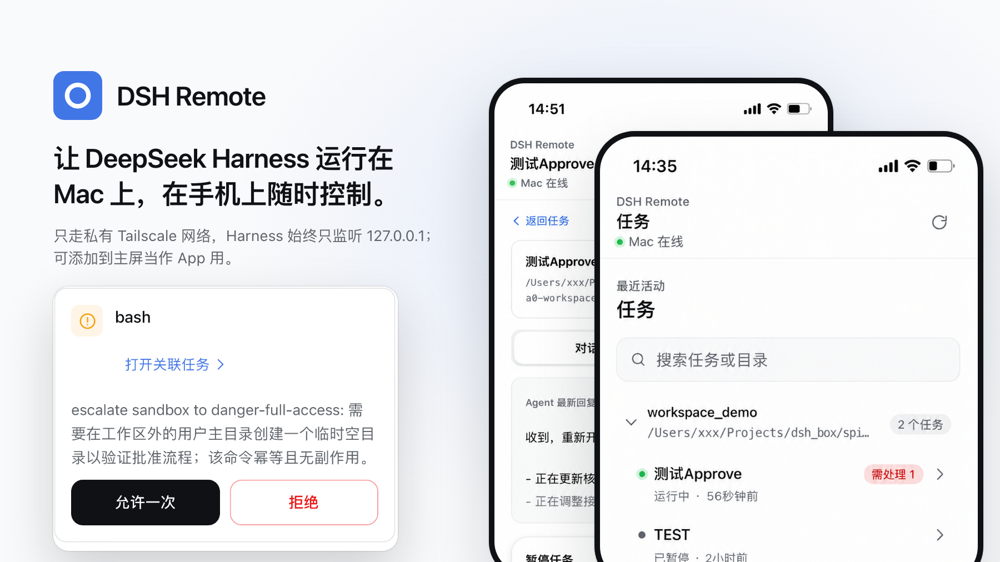

# DSH Remote

[](https://github.com/Zouu-X/dsh_remote/actions/workflows/ci.yml)
[](LICENSE)

**让 DeepSeek Harness 运行在 Mac 上，在手机上随时控制。**

DSH Remote 通过你的私有 Tailscale 网络，为 [DeepSeek Harness](https://github.com/deepseek-ai/deepseek-harness) 提供专为手机设计的工作界面。离开电脑也能发起任务、实时跟进 Agent、处理审批并阅读结果，同时不把 Harness 暴露到公网。

[English](README.en.md)

<!-- README_MEDIA_SLOT:HERO -->

<p align="center">
  
</p>

## 你可以做什么

- 在 Mac 已配置的任意工作区中发起任务。
- 开始前选择 Agent 工作模式、模型和思考强度。
- 在适合手机阅读的任务对话中实时查看 Agent 消息与任务状态。
- 从任务输入框排队下一条指令，或在运行中直接追加要求。
- 回答 Agent 问题，允许或拒绝一次性权限请求。
- 在 Mac 上触发预先配置的类型检查、测试或构建，并从手机查看实时日志。
- 打开受保护的本地 Web 预览，在手机里完成手动交互验证。
- 在适合手机浏览的工作区视图中搜索并继续既有任务。
- 添加到主屏幕作为 PWA 使用，并在网络恢复后自动重连。

## 安装

你需要：

- 一台已经配置 DeepSeek Harness 凭据的 Mac；
- Mac 和手机都安装 Tailscale，并登录同一个 tailnet；
- 为该 tailnet 启用 MagicDNS。

### 1. 运行引导式安装

```bash
git clone https://github.com/Zouu-X/dsh_remote.git dsh-remote
cd dsh-remote
./macos/launch-agent/setup.sh
```

安装脚本会检查 Mac 环境、安装项目依赖、构建手机端、安装用户级 LaunchAgent、配置 Tailscale Serve，并打印手机访问地址。如果缺少 Node.js 或 Tailscale 且系统已有 Homebrew，脚本会提供标准安装路径。

### 2. 启动 DeepSeek Harness

安装完成后会打印适用于当前 Mac 的完整命令，形式如下：

```bash
npx @deepseek-ai/dsh web --trusted-host <你的-Mac>.<你的-tailnet>.ts.net
```

保持 Harness 运行。只要 Harness 在 `127.0.0.1:3080` 监听，DSH Remote 就会自动上线。

### 3. 在手机上打开

打开安装脚本打印的地址：

```text
https://<你的-Mac>.<你的-tailnet>.ts.net
```

添加到主屏幕，即可获得接近原生应用的启动体验。

## 不打扰工作的手机流程

1. 打开**新任务**并选择工作区。
2. 选择工作模式；需要时设置模型和思考强度。
3. 提交任务，实时查看 Agent 执行过程。
4. 在**等待处理**中回答问题或处理一次性审批。
5. 返回任务对话，阅读 Agent 的结果或继续追问。
6. 之后可从**任务**继续同一项工作。

<!-- README_MEDIA_SLOT:WORKFLOW_DEMO -->

## 私有优先的设计

DSH Remote 把敏感部分留在你的 Mac 上：

- DeepSeek Harness 只监听 `127.0.0.1:3080`。
- Remote Host 只监听 `127.0.0.1:3090`。
- Tailscale Serve 提供私有 HTTPS 入口，不使用 Tailscale Funnel。
- Remote Host 从可信的本机代理连接解析真实 Tailscale 对端，不信任浏览器提交的身份 Header。
- 远程只开放下方列出的任务方法；凭据、设置、本地文件选择和 Preset 编辑继续只在 Mac 本机可用。
- DeepSeek API 凭据继续由 Harness 自己管理，DSH Remote 不会读取它。
- Remote Host 的设备私钥保存在 macOS Keychain。

DSH Remote 面向个人 Mac 与私有的单用户 tailnet。你可以使用内置白名单管理器，把访问范围进一步限制到指定手机。

## 只允许你的手机访问

默认情况下，已经通过身份验证加入同一 tailnet 的设备可以访问 Remote Host。若只允许指定设备：

```bash
# 查找手机的 Tailscale 节点 ID。
tailscale status

# 把手机加入白名单。
macos/launch-agent/devices.sh add <tailscale-device-id>

# 查看当前白名单。
macos/launch-agent/devices.sh list
```

LaunchAgent 重启后改动立即生效。脚本会拒绝删除最后一个允许设备，避免一次编辑意外扩大访问范围。如需主动恢复为允许整个 tailnet，请运行：

```bash
macos/launch-agent/devices.sh allow-all
```

## 日常运行

安装后的用户级 LaunchAgent 会在登录时启动并等待 Harness。Harness 启动后 DSH Remote 自动上线；Harness 停止后 Remote Host 也会随之退出。默认 `auto` 唤醒策略只在有 Harness Session 运行时阻止 Mac 休眠。

常用诊断命令：

```bash
# 确认两个本地服务。
lsof -nP -iTCP:3080 -sTCP:LISTEN
lsof -nP -iTCP:3090 -sTCP:LISTEN

# 检查本地 Remote Host。
curl http://127.0.0.1:3090/api/health

# 查看 Tailscale Serve。
tailscale serve status

# 跟踪日志。
tail -f ~/.dsh-remote/logs/remote-host.err.log
```

卸载 LaunchAgent：

```bash
macos/launch-agent/uninstall.sh
```

## 手动安装

如果希望自己控制每一步，可以使用下面的流程。

### 构建

```bash
corepack pnpm install
corepack pnpm -r build
```

### 获取 MagicDNS 主机名

```bash
DSH_TS_HOST=$(tailscale status --json | python3 -c 'import json,sys; print(json.load(sys.stdin)["Self"]["DNSName"].rstrip("."))')
echo "$DSH_TS_HOST"
```

### 启动 Harness 并安装 Remote Host

```bash
npx @deepseek-ai/dsh web --trusted-host "$DSH_TS_HOST"
```

在另一个终端中运行：

```bash
macos/launch-agent/install.sh
macos/launch-agent/configure-tailscale-serve.sh
tailscale serve status
```

## 配置

`install.sh` 会读取当前环境变量，也可以从已被 Git 忽略的 `macos/launch-agent/launch-agent.env` 读取。

| 变量 | 默认值 | 用途 |
| --- | --- | --- |
| `DSH_REMOTE_HARNESS_URL` | `http://127.0.0.1:3080` | Harness HTTP 地址 |
| `DSH_REMOTE_PORT` | `3090` | Remote Host 监听端口 |
| `DSH_REMOTE_STATIC_DIR` | `<repo>/apps/mobile-web/dist` | 构建后的手机端目录 |
| `DSH_REMOTE_STATE_FILE` | `~/.dsh-remote/host-state.json` | 持久化的 Mac Host 身份 |
| `DSH_REMOTE_ALLOWED_DEVICE_IDS` | 空 | 逗号分隔的 Tailscale 设备 ID；为空时允许整个 tailnet |
| `DSH_REMOTE_IDENTITY_PROVIDER` | `tailscale` | 解析 Tailscale 对端身份；`none` 时仅接受 loopback |
| `DSH_REMOTE_SECRET_STORE` | `mac-keychain` | 在 Keychain 中保存 Remote Host 设备私钥 |
| `DSH_REMOTE_CAFFEINATE` | 安装后为 `auto` | Session 活跃时保持 Mac 唤醒 |
| `DSH_REMOTE_CHECKS_FILE` | 空 | 允许手机触发的检查命令 JSON 文件 |
| `DSH_REMOTE_PREVIEWS_FILE` | 空 | 允许手机打开的本机 Web 预览 JSON 文件 |
| `DSH_REMOTE_PREVIEW_SECRET` | 每次启动随机生成 | 预览短期访问令牌的签名密钥；自定义值至少 16 字节 |
| `DSH_REMOTE_VAPID_SUBJECT` | `mailto:dsh-remote@example.invalid` | Web Push 的 VAPID subject |
| `DSH_REMOTE_VAPID_PUBLIC_KEY` / `DSH_REMOTE_VAPID_PRIVATE_KEY` | 自动生成并保存 | Web Push 密钥；也可以通过 `DSH_REMOTE_VAPID_KEYS_FILE` 指定密钥文件 |
| `DSH_REMOTE_VAPID_KEYS_FILE` | `<state-file>.vapid.json` | 自动生成的 VAPID 密钥文件 |
| `DSH_REMOTE_PUSH_SUBSCRIPTIONS_FILE` | `<state-file>.push.json` | 手机 Push 订阅持久化文件 |
| `DSH_REMOTE_HARNESS_POLL_SECONDS` | `15` | Harness 可用性检查间隔 |
| `DSH_REMOTE_NODE` | 安装时自动检测 | LaunchAgent 使用的 Node 可执行文件 |

如果希望 LaunchAgent 同时管理 Harness：

```bash
DSH_INSTALL_HARNESS_SUPERVISOR=1 macos/launch-agent/install.sh
```

默认仍由用户手动管理 Harness，让升级和凭据始终处于你的控制之下。

### 手机触发项目检查

检查命令采用显式白名单；手机只能选择 `checkId`，不能提交任意 shell 字符串。例如：

```json
[
  {
    "checkId": "typecheck",
    "label": "TypeScript 类型检查",
    "command": "pnpm",
    "args": ["typecheck"],
    "cwd": "/Users/me/Projects/my-app",
    "timeoutMs": 120000
  },
  {
    "checkId": "test",
    "label": "单元测试",
    "command": "pnpm",
    "args": ["test"],
    "cwd": "/Users/me/Projects/my-app",
    "timeoutMs": 180000
  }
]
```

执行器使用 `spawn(command, args, { shell: false })`，限制同一工作目录同时只有一个检查，记录截断后的输出、退出码、超时和工作区指纹。重复提交带有相同幂等键的请求只会启动一次进程。

### 手机打开 Web 预览

预览目标也采用显式白名单，并且只接受 Mac 本机的 loopback 地址：

```json
[
  {
    "previewId": "my-app",
    "label": "My App 开发预览",
    "origin": "http://127.0.0.1:5173"
  }
]
```

设置 `DSH_REMOTE_PREVIEWS_FILE` 后，手机在任务页点击“打开预览”即可通过 Remote Host 的同源代理访问该服务。每次打开都会生成绑定用户和设备、默认 10 分钟过期的 HMAC 令牌；代理会转发页面资源和交互请求，并重写 HTML 中的根路径资源。项目如果把 API 或资源地址硬编码成绝对域名，应在开发服务器配置中设置正确的 base path。

### 后台通知与 iPhone

Remote Host 使用 VAPID Web Push，不让手机后台保持长连接。首次开启通知需要在页面按钮中完成授权；iPhone/iPad 需要 iOS 16.4 或更新版本，并先通过 Safari 的“添加到主屏幕”安装 PWA。入口使用 Tailscale Serve 提供的 HTTPS，因此不需要 Apple Developer 账号或 APNs 开发证书。通知点击后会打开对应的任务对话。

## 工作原理

```text
手机 PWA
  │  私有 tailnet 内的 HTTPS/WSS
  ▼
Mac 上的 Tailscale Serve
  │  TLS 终止 + PROXY protocol
  ▼
Remote Host · 127.0.0.1:3090
  │  身份解析、能力检查、幂等、事件信封
  ▼
DeepSeek Harness Adapter
  │  白名单 HTTP/WS 转换
  ▼
DeepSeek Harness · 127.0.0.1:3080
```

手机 UI 只依赖 `AgentHostTransport`，不依赖 Harness 内部类型。所有 DeepSeek Harness 上游调用集中在唯一 Adapter 中；协议、领域模型、认证策略、客户端传输和 Host 进程保持为独立包。

### Remote API 边界

Remote Host 只开放：

- `host.describe`
- `workspace.list`、`workspace.create`
- `session.list`、`session.search`、`session.create`、`session.history`、`session.prompt`
- `agent-preset.list`、`agent-preset.select`
- `session.models`、`session.select-model`
- `approval.respond`、`question.respond`
- `check.list`、`check.run`、`check.get`、`check.cancel`
- `preview.list`、`preview.open`，以及带短期令牌的同源预览代理
- `push.vapid`、`push.list`、`push.subscribe`、`push.unsubscribe`

设置、凭据、本地路径选择/打开和 Preset 修改方法均不可远程调用；检查命令和预览目标必须由 Mac 端配置文件明确声明。

## 仓库结构

| 路径 | 职责 |
| --- | --- |
| `apps/mobile-web` | React/Vite 手机 PWA |
| `packages/remote-protocol` | 版本化 RPC 与事件信封 |
| `packages/remote-domain` | Host、工作区、任务、审批、问题和事件历史模型 |
| `packages/remote-client` | `AgentHostTransport` 与 tailnet 直连传输 |
| `packages/remote-host` | Loopback HTTP/WebSocket Host 与身份边界 |
| `packages/auth-core` | Principal、角色、能力和远程方法策略 |
| `packages/adapter-deepseek` | 唯一使用 Harness 线协议的包 |
| `macos/launch-agent` | 引导安装、LaunchAgent 模板、访问管理和诊断 |
| `tools` | 连通性与 Remote Host 检查工具 |

## 开发

```bash
corepack pnpm install
corepack pnpm typecheck
corepack pnpm test
corepack pnpm build
```

启动开发服务：

```bash
corepack pnpm dev:mobile
corepack pnpm dev:host
```

构建并启动 Harness 后运行 Remote Host 自检：

```bash
node tools/remote-host-check/check.mjs --base http://127.0.0.1:3090
```

DSH Remote 是独立社区项目，与 DeepSeek 没有隶属或背书关系。

## 许可证

[MIT](LICENSE)
